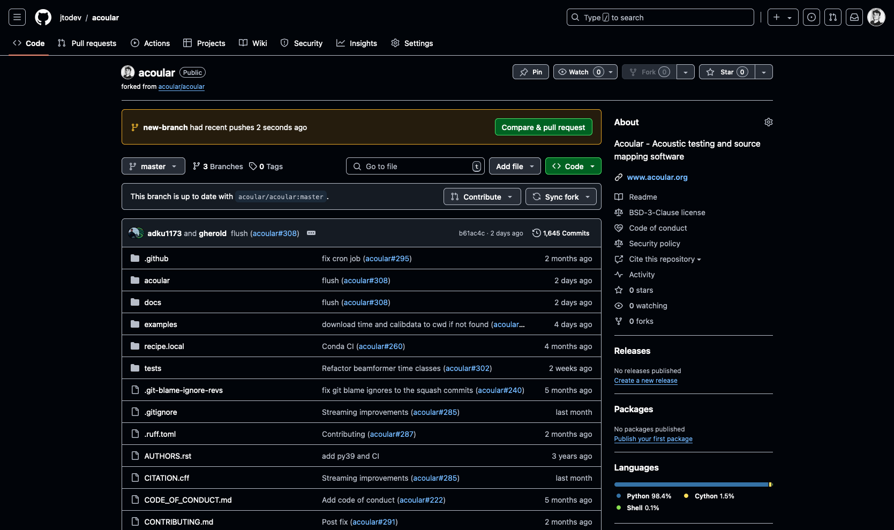
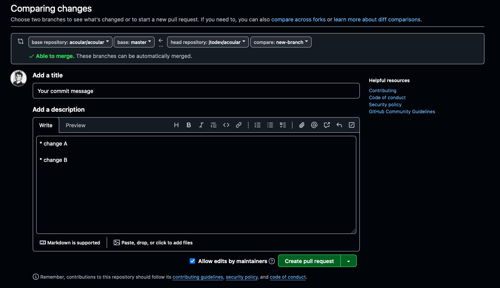

.. _Submitting a pull request:

Submitting a pull request
=========================

Preparing the branches
----------------------

Before submitting your fist pull request, make sure to have the commits you want so submit on a branch other than your ``master`` branch. If not, add a new branch like this:

.. code-block:: bash
    
    git branch new-branch

You have just created a new branch called ``new-branch``. This branch will have the same commit history as the ``master`` branch.

You want to keep the ``master`` branch in sync with the ``master`` branch on the main `Acoular repository <https://github.com/acoular/acoular>`_ on GitHub. To make sure it is, look `here <https://docs.github.com/en/pull-requests/collaborating-with-pull-requests/working-with-forks/syncing-a-fork>`_.

In case your ``master`` branch has changed, execute the following commands to make sure that there will be no merge conflicts later on. Mind that you should be on your ``master`` branch when doing this.

.. code-block:: bash

    git fetch
    git reset origin/master
    git checkout new-branch
    git rebase master

You are now on the ``new-branch`` branch. If you are pleased with your changes and they meet the criteria stated in the contributing guidelines, push your changes to your GitHub repository. At this point, there might be no upstream branch in your GitHub repository. To create one, execute:

.. code-block:: bash

    git push --set-upstream origin new-branch

Creating a pull request on GitHub
---------------------------------

If you visit to your forked Acoular repository on GitHub now, you will see something like this:

Note the orange box. To open a pull request, click on ``Compare & pull request``. Alternatively you can select the branch you want to commit in the branch menu and click ``Contribute``.

The page you will get redirectet to, will look like this:

Make sure to fill out the form with a proper commit message and to list your changes below and to read the :doc:`checklist`.

Click ``Create pull request`` to submit your changes and get them reviewed.