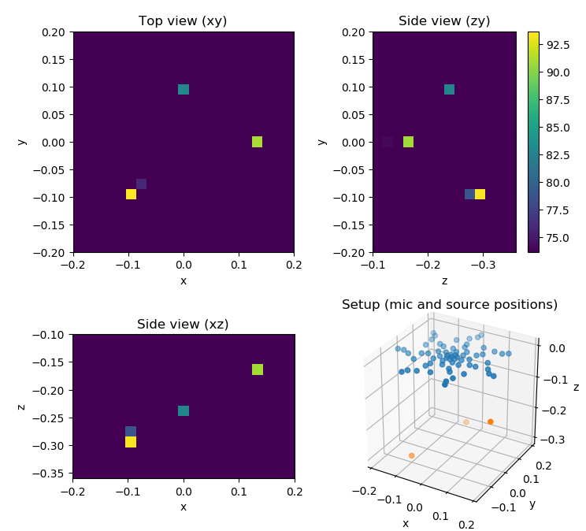

Example 3
=========
This example demonstrates a 3D beamforming setup. The visualization uses the Mayavi package. Please note, that Mayavi ist not yet available for Python 3.   

Download: :download:`example3.py <../../../examples/example3.py>`

The script produces the figure:

    Result for the trailing edge noise in 3D using beamforming (Such results will be useful only if a fast deconvolution method is applied.)

.. literalinclude:: ../../../examples/example3.py
