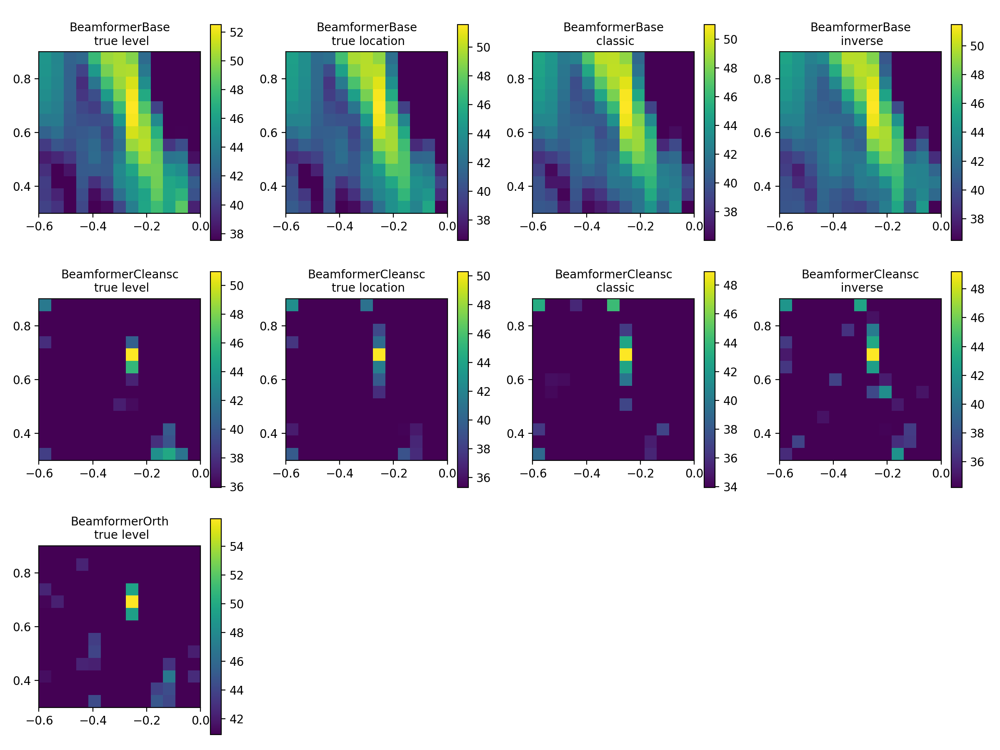

Example 4
=========
Demonstrates different beamformers in frequency domain,

* setting of steering vector type,
* disabling of result caching,
* persistence (saving of configured beamformers)

Download: :download:`example4.py <../../../examples/example4.py>`

The script produces the figure:

.. literalinclude:: ../../../examples/example4.py
