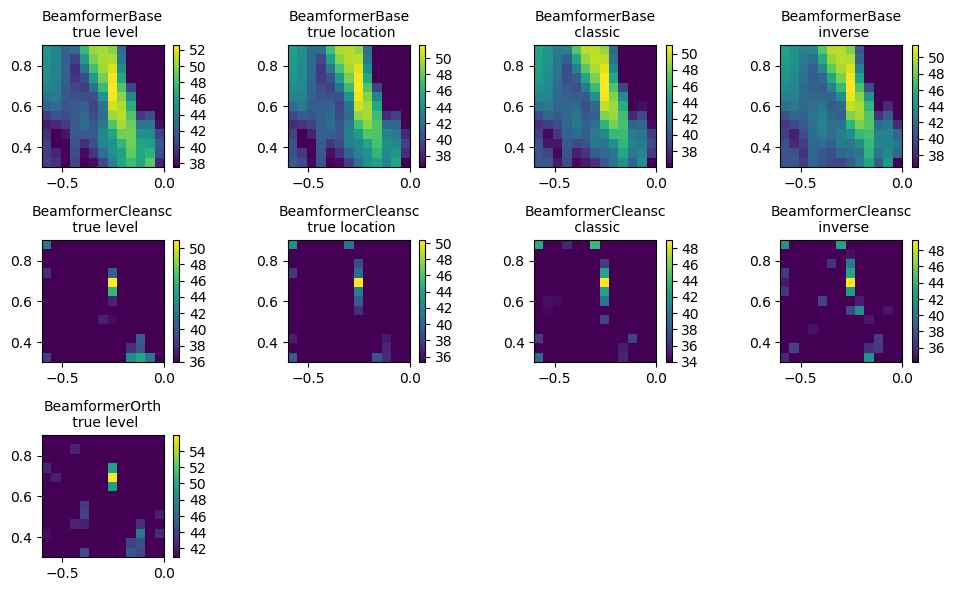

Example 5
=========

Demonstrates different beamformers in frequency domain,

* persistence (loading of configured beamformers), see example 4 for 
  the first part (saving)

Download: :download:`example5.py <../../../examples/example5.py>`

The script produces the figure:

.. literalinclude:: ../../../examples/example5.py
