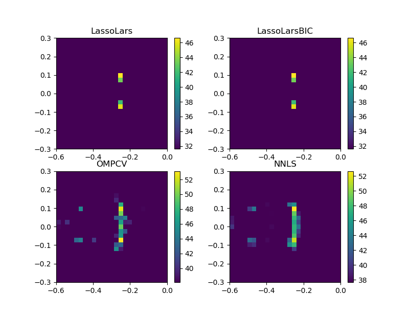

Example 7
=========
Demonstrates CMF methods same setup as in :doc:`example1`.

It needs the measured timeseries data in :download:`example_data.h5 <../../../examples/example_data.h5>` and calibration in :download:`example_calib.xml <../../../examples/example_calib.xml>`. Both files should reside in the same directory as the :download:`example7.py <../../../examples/example7.py>` script.

The script produces the figure:

.. literalinclude:: ../../../examples/example7.py
