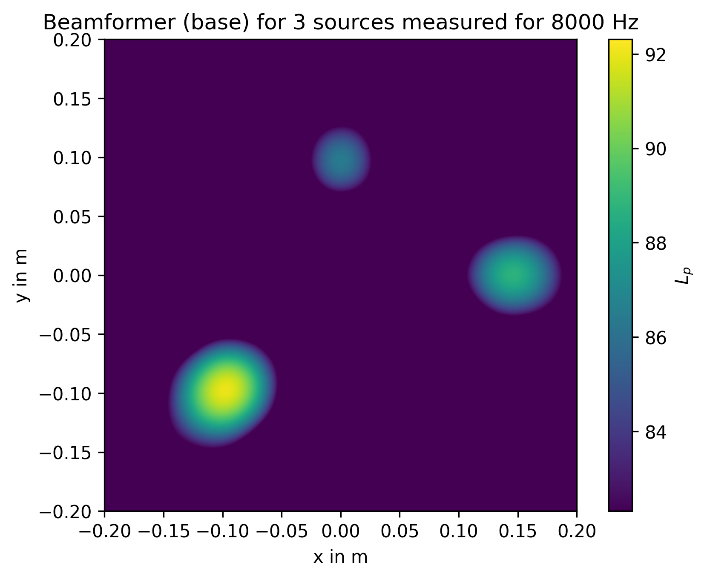

Getting Started
===============

The Acoular library is based on the Python programming language. While a basic knowledge of Python is definitely helpful, the following first steps do not require this. A number of good Python tutorials can be found on the web. 

Prerequisites
-------------
This "Getting started" tutorial assumes that the Acoular library is :doc:`installed<../install/index>` together with its dependencies and matplotlib, and that the demo finished successfully. If you did not run the demo yet, you should do so by typing into your python console

.. ipython:: 

    In [1]: import acoular
    
    In [1]: acoular.demo.acoular_demo.run()

This should, after some seconds, produce two pictures (a 64 microphone arrangement and a beamforming map with three sources). You may close the pictures in order to continue. 

Apart from showing that everything works well, the demo also produced some data to work on. You should now have a **file 'three_sources.h5' (13MB)** in your working directory.

Beamforming example step-by-step 
--------------------------------

One possible way to use the library is for doing classic delay-and-sum beamforming. This can either be done directly in the time domain or in the frequency domain. To get started with Acoular, we will present a very basic example of beamforming in the frequency domain. In order to perform such an analysis we do need some data to work on. In a practical application, this data is acquired during multichannel measurements using a microphone array. The library provides some functionality to do so and stores the measured sound pressure time histories for all channels of the microphone array in a hierarchical data file (HDF5) format. 
However, a working measurement set-up is required. Thus, we will use simulated data here. The 'three_sources.h5' file, generated using Acoular's simulation capabilities (see the :doc:`reference <../api_ref/index>`), contains the time history data for 64 microphone channels, which are sampled at 51200 Hz for a duration of 1 second, i.e. 51200 samples per channel. 

In what follows, it is assumed that an interactive python session is started, preferably an IPython or jupyter session:

>>> ipython

Then, the first step to perform an analysis is to import the Acoular library:

.. ipython::

    In [1]: import acoular

This makes all the functionality available needed for the beamforming analysis. We start with making the data from the HDF5 file available and create and instance of :class:`~acoular.sources.TimeSamples` :

.. ipython::

    In [1]: ts = acoular.TimeSamples( name='three_sources.h5' )

The ts object now provides access to the HDF5 file and information stored in it. 

.. ipython::

    In [1]: ts

    In [1]: ts.sample_freq

It is important to note that the data in the file is **not read into the memory** for it could be very large (i.e. several GB). Instead, the data is read in small chunks the moment it is needed. Because this is done automatically, the user does not have to take care of that.

The beamforming shall be done in the frequency domain. In this case the cross spectral matrix is the basis. This matrix consists of the cross power spectra of all possible combinations of channels. Here, this gives 64²=4096 cross power spectra. These spectra are computed using Welch's method, i.e. blocks of samples are taken from the signals and fourier-transformed using FFT, used to calculate the power spectra, and then the results are averaged over a number of blocks. The blocks have a certain length and may be overlapping. In addition, a windowing function may be applied to each block prior to the FFT. To provide the facilities to calculate the cross spectral matrix we create an instance of :class:`~acoular.spectra.PowerSpectra` and define the size of the blocks to be 128 samples and a von-Hann ('Hanning') window to be used:  

.. ipython::

    In [1]: ps = acoular.PowerSpectra( time_data=ts, block_size=128, window='Hanning' )

The data for the calculation is to be taken from the ts object that was created before. Because the calculation of the cross spectral matrix is a time consuming process, no calculation is performed at the moment, but is **delayed** until the result is actually needed. This concept of **"lazy evaluation"** is applied wherever possible throughout the Acoular library. This prevents unnecessary time-consuming computations. Another option to set the parameters for the Welch method would have been to first create a 'blank' or 'default' :class:`~acoular.spectra.PowerSpectra` object and set the parameters, or traits of the object, afterwards:

.. ipython::

    In [1]: ps = acoular.PowerSpectra()

    In [1]: ps.time_data = ts

    In [1]: ps.block_size = 128

    In [1]: ps.window='Hanning'

If one or more parameters are changed after the computation of the cross spectral matrix, it will be automatically **recalculated** the next time it is needed.

Our aim is to produce a mapping of the acoustic sources. Because such a map can be produced only when having a number of possible source positions available, these positions must be provided by creating a :class:`~acoular.grids.Grid` object. More specifically, we want to create a :class:`~acoular.grids.RectGrid` object, which provides possible source positions in a regular, two-dimensional grid with rectangular shape:

.. ipython:: 

    In [1]: rg = acoular.RectGrid( x_min=-0.2, x_max=0.2, y_min=-0.2, y_max=0.2, z=0.3, increment=0.01 )

The traits assigned in brackets determine the dimensions of the grid and distance (increment) between individual source positions. Using

.. ipython:: 

    In [1]: rg.size

we can ask about the number of possible source positions in the grid.

The positions of the microphones are needed for beamforming, so we create a :class:`~acoular.microphones.MicGeom` object, that reads the positions from a .xml file. Here we use array_64.xml, which is part of the library. To access the location of the file we first have to import the os.path library (part of standard python) and query the location of the file in the file system.

.. ipython:: 

    In [1]: from os import path

    In [1]: micgeofile = path.join(path.split(acoular.__file__)[0],'xml','array_64.xml')

    In [1]: mg = acoular.MicGeom( from_file=micgeofile )

In order to plot the microphone arrangement, we make use of the convenient matplotlib library with its pylab interface:

.. ipython:: 

    In [1]: import pylab as plt

    In [1]: plt.ion() # switch on interactive plotting mode

    In [1]: plt.plot(mg.mpos[0],mg.mpos[1],'o')

.. figure:: array64_py3colormap.png
   :align: center
   :scale: 50%

The sound propagation model (including the source model and transfer path) is contained in a :class:`~acoular.fbeamform.SteeringVector` object, which is given the focus grid and microphone arrangement to calculate the steering vector, which also contains a weighting of the transfer functions from grid points to microphone positions:

.. ipython:: 

    In [1]: st = acoular.SteeringVector( grid=rg, mics=mg )

Finally, we can create the object that encapsulates the delay-and-sum algorithm. The basic beamforming algorithm is provided by objects of the type :class:`~acoular.fbeamform.BeamformerBase` 

.. ipython:: 

    In [1]: bb = acoular.BeamformerBase( freq_data=ps, steer=st )

The cross spectral matrix and the steering vector, which were created before, are used here as input data. Still, **up to now, no computation has been done** because no result was needed yet. Using 

.. ipython:: 

    In [1]: pm = bb.synthetic( 8000, 3 )

    In [1]: Lm = acoular.L_p( pm )

the beamforming result mapped onto the grid is queried for a frequency of 8000 Hz and over a third-octave wide frequency band (thus the '3' in the second argument). As a consequence, processing starts: the data is read from the file, the cross spectral matrix is computed and the beamforming is performed. The result (sound pressure squared) is given as an array with the same shape as the grid. Using the helper function :class:`~acoular.fbeamform.L_p`, this is converted to decibels.

Now let us plot the result:

.. ipython:: 

    In [1]: plt.figure() # open new figure

    In [1]: plt.imshow( Lm.T, origin='lower', vmin=Lm.max()-10, extent=rg.extend(), interpolation='bicubic')

    In [1]: plt.colorbar()

which shows the following map, scaled to a range between the maximum value and 10 dB below it, and with the axes scales derived from the :class:`~acoular.grids.RectGrid` data object. 

It appears that the three sources correspond to the local maxima in the map and that the relative height of two lesser maxima is -3 dB and -6 dB. These are the expected results, because the simulation that produced the data assumes source locations (relative to array center) and levels that are given in the following table:

====== =============== ======
Source Location        Level 
====== =============== ======
1      (-0.1,-0.1,0.3) 1 Pa
2      (0.15,0,0.3)    0.7 Pa 
3      (0,0.1,0.3)     0.5 Pa
====== =============== ======

as would be expected from the values given in the table above.

To play around with this simple example, download :download:`basic_beamformer_example.py <../../../examples/basic_beamformer_example.py>` change something and run it as a Python script.

.. literalinclude:: ../../../examples/basic_beamformer_example.py

To see how the simulated data is generated, read :download:`three_sources.py <../../../examples/three_sources.py>`. 

.. literalinclude:: ../../../examples/three_sources.py
