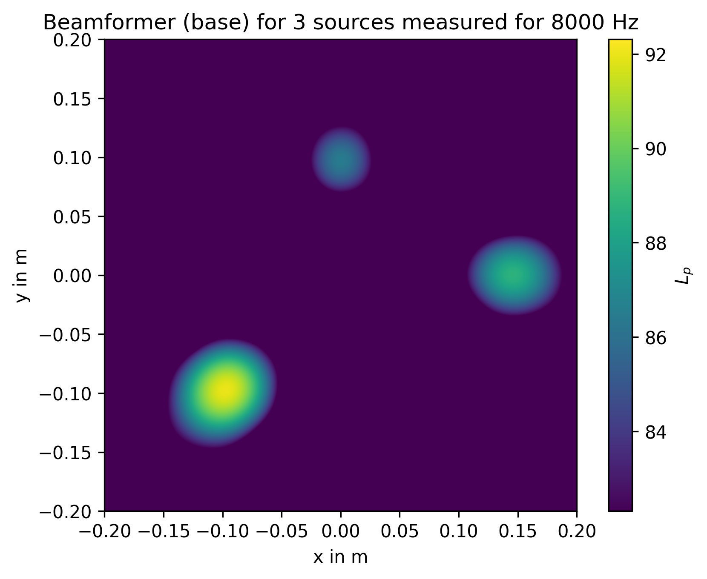

.. Acoular documentation master file

Acoular -- Acoustic testing and source mapping software
=======================================================

Acoular is a framework for acoustic beamforming that is written in the Python programming language. It is aimed at applications in acoustic testing. Multichannel data recorded by a microphone array can be processed and analyzed in order to generate mappings of sound source distributions. The maps (acoustic photographs) can then be used to  locate sources of interest and to characterize them using their spectra. 

.. image:: _static/Airfoil_selfnoise_3d.png
    :width: 33%
    :alt: Airfoil leading edge noise
.. image:: _static/pantograph_noise_3d.png
    :width: 33%
    :alt: Pantograph noise

A few highlights of the framework:

    * covers several beamforming algorithms 
    * different advanced deconvolution algorithms
    * both time-domain and frequency-domain operation included
    * 3D mapping possible
    * application for stationary and for moving targets
    * supports both scripting and graphical user interface
    * efficient: intelligent caching, parallel computing with Numba
    * easily extendible and well documented

Problems, suggestions and success using Acoular may be reported via the `acoular-users  <https://groups.google.com/forum/#!forum/acoular-users>`_ discussion forum or to *info (at) acoular.org*.

Our blog has detailed `tutorials <https://acoular.github.io/blog/>`_ about how to set up and run an analysis and how to provide input data.

Contents:

.. toctree::
    :hidden:
    
    How to Get <install/index>
    Getting Started <get_started/index>
    What's new <news/index>
    Literature <literature/index>
    Examples <examples/index>
    API Reference <api_ref/index>

.. list-table::
    :widths: 30 70
    
    * - :doc:`install/index` 

      - Description of the different download and installation options to get 
        Acoular running on your system.

    * - :doc:`get_started/index` 

      - The basics for using Acoular explained with a simple example.

    * - :doc:`news/index` 

      - Release notes for the current version of Acoular.

    * - :doc:`examples/index` 

      - Example scripts covering different use cases.

    * - :doc:`api_ref/index` 

      - All modules, classes and methods featured in Acoular are described in detail
        here. They can easily be browsed through an inheritance tree and cross links.

    * - :doc:`literature/index` 

      - In here some of the publications used for this program package are 
        listed. Further reading to fully understand how the algorithms work is recommended.

        
Indices and tables
==================

* :ref:`genindex`
* :ref:`modindex`
* :ref:`search`

.. raw:: html

    <a href="https://github.com/acoular/acoular">Fork me on GitHub</a>