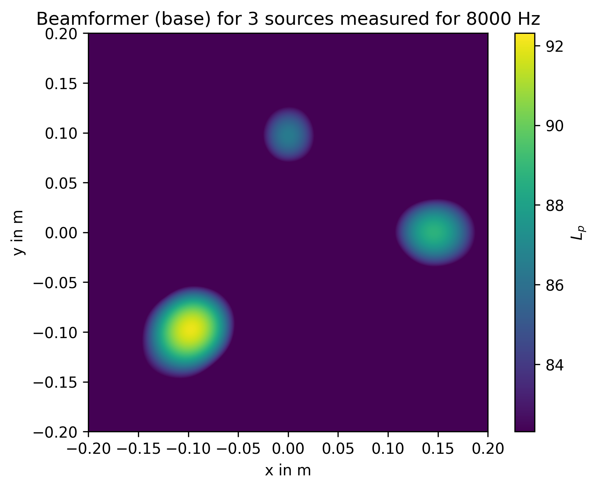
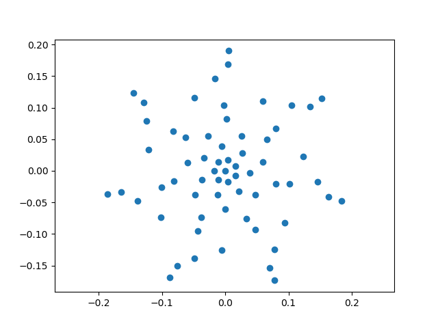

.. _get_started:

Getting Started
===============

The Acoular library is based on Python. This guide walks through a small
frequency-domain beamforming workflow using the same example scripts that are
built and tested in the documentation gallery.

Prerequisites
-------------

This tutorial assumes that Acoular is :doc:`installed<../install/index>`
together with its dependencies and ``matplotlib``.

If you have not run the demo yet, run ``acoular.demo.run()`` in Python once.
Besides checking that the installation works, the demo creates a
``three_sources.h5`` file in the current working directory. The following
example uses that file.

The full runnable scripts used on this page are:

* :doc:`../auto_examples/introductory_examples/example_three_sources`
* :doc:`../auto_examples/introductory_examples/example_basic_beamforming`

Generate Example Data
---------------------

If you want to create the input data yourself instead of using the demo output,
the gallery example :doc:`../auto_examples/introductory_examples/example_three_sources`
generates a synthetic measurement file with three sources.

The example imports Acoular and defines the output file and basic signal setup:

.. literalinclude:: ../../examples/introductory_examples/example_three_sources.py
   :language: python
   :start-after: # Import packages.
   :end-before: # Generate and store the example data.

Then it creates three point sources, mixes them, and writes the result to
``three_sources.h5``:

.. literalinclude:: ../../examples/introductory_examples/example_three_sources.py
   :language: python
   :start-after: # Generate and store the example data.
   :end-before: # %%

Beamforming Example Step By Step
--------------------------------

One common Acoular workflow is classic delay-and-sum beamforming in the
frequency domain. The gallery example
:doc:`../auto_examples/introductory_examples/example_basic_beamforming`
contains the full runnable script. This section walks through the same script in
small pieces.

First, import the required packages and define the paths to the microphone
geometry and the input data:

.. literalinclude:: ../../examples/introductory_examples/example_basic_beamforming.py
   :language: python
   :start-after: # Import packages.
   :end-before: # Load geometry and time data.

The microphone geometry is loaded from the Acoular package, and the time-domain
measurement data is accessed through a :class:`~acoular.sources.TimeSamples`
object:

.. literalinclude:: ../../examples/introductory_examples/example_basic_beamforming.py
   :language: python
   :start-after: # Load geometry and time data.
   :end-before: # Define spectral processing.

The ``ts`` object provides access to the HDF5 file and its metadata. The sample
data is not loaded into memory all at once. Instead, Acoular reads it in blocks
when later processing steps request it.

Next, define the spectral processing. The
:class:`~acoular.spectra.PowerSpectra` object computes the cross-spectral
matrix using Welch's method with a block size of 128 samples and a Hanning
window:

.. literalinclude:: ../../examples/introductory_examples/example_basic_beamforming.py
   :language: python
   :start-after: # Define spectral processing.
   :end-before: # Define grid and steering vector.

At this point no cross-spectral matrix has been calculated yet. Acoular uses
:ref:`lazy_evaluation`, so the expensive work starts only when a result is
actually requested.

To beamform, define a focus grid and steering vector:

.. literalinclude:: ../../examples/introductory_examples/example_basic_beamforming.py
   :language: python
   :start-after: # Define grid and steering vector.
   :end-before: # Calculate beamforming result.

The grid contains the candidate source positions. The steering vector combines
that grid with the microphone geometry and sound propagation model.

Now create the beamformer and request a third-octave map around 8000 Hz:

.. literalinclude:: ../../examples/introductory_examples/example_basic_beamforming.py
   :language: python
   :start-after: # Calculate beamforming result.
   :end-before: # Plot beamforming map.

This is the line where processing starts. Acoular reads the time data,
calculates the cross-spectral matrix, performs beamforming, and converts the
result to decibels.

Plotting The Result
-------------------

The beamforming map is plotted as:

.. literalinclude:: ../../examples/introductory_examples/example_basic_beamforming.py
   :language: python
   :start-after: # Plot beamforming map.
   :end-before: # Plot microphone arrangement.

The same example also plots the microphone arrangement:

.. literalinclude:: ../../examples/introductory_examples/example_basic_beamforming.py
   :language: python
   :start-after: # Plot microphone arrangement.

The map shows three local maxima at the simulated source positions. Their
relative levels match the synthetic input data:

====== =============== ======
Source Location        Level
====== =============== ======
1      (-0.1,-0.1,0.3) 1 Pa
2      (0.15,0,0.3)    0.7 Pa
3      (0,0.1,0.3)     0.5 Pa
====== =============== ======

Next Steps
----------

* See :ref:`lazy_evaluation` for a closer look at when Acoular actually starts
  calculating results.
* See :ref:`caching` for the file-based cache controls.
* Download and modify the full scripts if you want to experiment:

  * :download:`example_basic_beamforming.py <../../examples/introductory_examples/example_basic_beamforming.py>`
  * :download:`example_three_sources.py <../../examples/introductory_examples/example_three_sources.py>`
